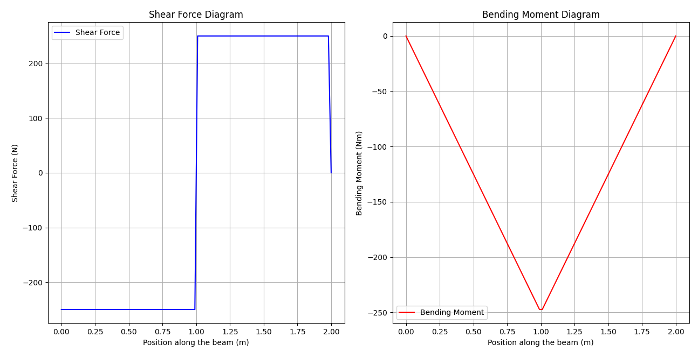
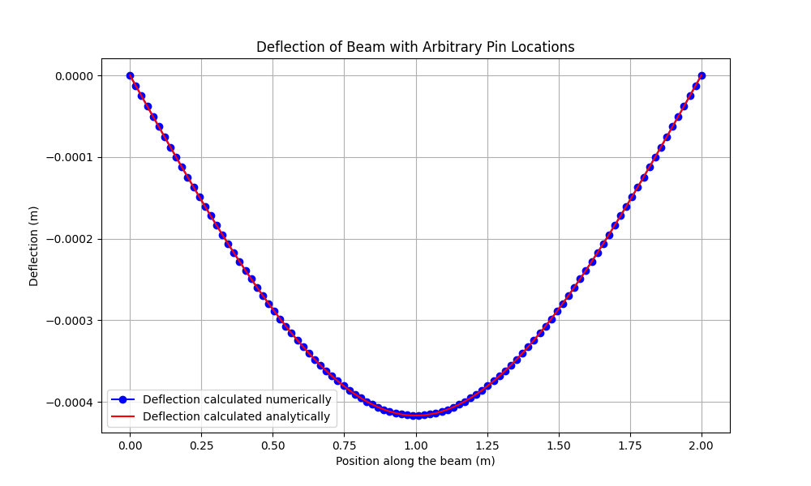

# Project Title (Still under Construction)

## Description
Design a MATLAB GUI to input beam parameters (dimensions, elasticity, joints, loads, moments) and output:

- Bending moment diagram
- Shear force diagram
- Deflection function along the beam's length
- Comparison of deflections under different boundary conditions

---

## Table of Contents

- [Approach](#approach)
- [Validation](#validation)
---

## Approach

### For Determinate systems: pinned supports
- **n unknown forces and n equations**: Forces are determined by solving moment balance equations at each pin. We approximate Uniformly distributed load (UDL) as a single force on UDL's centre of mass
- **Matrix inversion**: Used to estimate forces at each pinned joint.
- **Shear force and bending moments**: Calculated using the estimated forces.
- **Deflections estimation**: Finite difference equations based on Euler-Bernoulli theory are used to estimate beam deflections usng bending moments calculated above.

### Finite difference method:

**Bending Moment Equation:**

$$
M(x) = -EI \frac{d^2 w(x)}{dx^2}
$$

Where:
-  M(x)  is the bending moment at position \( x \).
-  E  is the modulus of elasticity of the beam material.
-  I  is the moment of inertia of the beam's cross-sectional area.
-  w(x)  is the deflection of the beam at position \( x \).

**FDM Equation**
The FDM equation is then:

$$
M_i = -EI \cdot \frac{w_{i+1} - 2w_i + w_{i-1}}{\Delta x^2}
$$

### Linear system of equations

Representing this equation in matrix form:

$$
\mathbf{A} \mathbf{w} = \mathbf{b}
$$

where:

- $\mathbf{A}$ is the tridiagonal matrix:

$$
\mathbf{A} =
\begin{bmatrix}
1 & 0 & 0 & \cdots & 0 \\
0 & -2 & 1 & \cdots & 0 \\
0 & 1 & -2 & \cdots & 0 \\
\vdots & \vdots & \vdots & \ddots & \vdots \\
0 & 0 & 0 & \cdots & -2 \\
0 & 0 & 0 & \cdots & 1
\end{bmatrix}
$$

- $\mathbf{w}$ is the vector of deflections:

$$
\mathbf{w} = \begin{bmatrix}
w_1 \\
w_2 \\
w_3 \\
\vdots \\
w_{N}
\end{bmatrix}
$$

- $\mathbf{b}$ is the vector of applied moments:

$$
\mathbf{b} = -\frac{\Delta x^2}{EI} \begin{bmatrix}
0 \\
M_2 \\
M_3 \\
\vdots \\
M_{N-1}\\
0
\end{bmatrix}
$$

First and last equations represented by the matrix represent pinned boundary conditions. The algorithm adjusts matrix A and b to take care of conditions where pins are in middle of the beam

### For In-determinate systems: fixed support (clamped)

For clamped beams (either both ends clamped or one end clamped), the moments at the clamped points are unknown. The following procedure is used:

1. **Assume Unknown Moments**: 
   - Assume unknown moments \( m_n \) at each clamped joint.

2. **Bending Moment Estimation**:
   - Use the standard procedure to estimate the bending moment distribution along the beam in terms of these unknown moments \( m_n \).

3. **Finite Difference Method (FDM) Equations**:
   - While solving the FDM equations, add an additional boundary condition that enforces the slope to be zero at each clamped joint (i.e., $ \frac{dw}{dx} = 0 $)

4. **Solve the System**:
   - Solve the resulting system of equations, which now includes the unknown moments \( m_n \).

5. **Estimate Shear Force and Bending Moment**:
   - Use the calculated moments \( m_n \) to determine the complete shear force and bending moment diagrams for the system.

## Validation

**Determinate systems**
Assume the beam is pinned at both ends and a force F = 500N is acting on the centre of the beam. Results of the simulation are:   
**Shear force and Bending Moment diagram**

**Deflection**

The numerical solution agrees with analytical solution perfectly, and hence our simulation is accurate.
